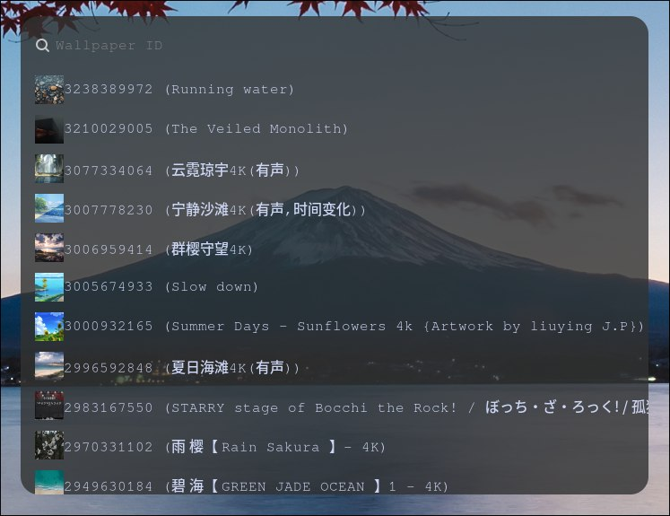

# Hyprland WallpaperEngine Chooser

I'm little bit tired to configure linux-wallpaperengine every time for every monitor i have so...

**Script to pick Wallpapers from Wallpaper Engine in Hyprland using linux-wallpaperengine and wofi.**

---

## 🚀 Features

- Select monitor (`DP-1`, `DP-2`, `HDMI-1`, etc.)
- Preview wallpapers with `[icon] ID (title)`
- Choose scaling mode (`stretch`, `fit`, `fill`, `default`)
- Edit launch flags (`--disable-mouse`, `--disable-parallax`,`--silent`, etc.)
- **Remembers flags per monitor**
- Writes `exec-once` entries to a separate config (`wallpaperengine.conf`) instead of modifying `hyprland.conf` directly
- Fixes black screen issue for NVIDIA users (based on fix from the [official repo](https://github.com/Almamu/linux-wallpaperengine))
- Kills the process for the selected monitor to prevent duplicates



---

## 🛠 Dependencies

- **wofi**
- **coreutils**
- **wl-clipboard**
- **[linux-wallpaperengine](https://github.com/Almamu/linux-wallpaperengine)**

---

## 📦 Installation

```bash
# Clone repo
git clone git@github.com:Kananoro/hypr-wallpaperengine-chooser.git
cd hypr-wallpaperengine-chooser

# Make the script executable
chmod +x wallpaper.sh
```

## ⚙️ Configuration

- Add `source = ~/.config/hypr/wallpaperengine.conf (Or any other path you choose in $WALLPAPERCONF)` to your `hyprland.conf` manually. The script won't do it automatically for safety reasons.
- Edit the `STEAM_DIR` variable in the script if your paths are different
  - Leave `NVIDIA_ENV` empty if you don't use NVIDIA GPU
- Ensure `hyprland.conf` doesn't contain duplicate `exec-once` lines for `linux-wallpaperengine`
- (Optional) Adjust your wofi style (`~/.config/wofi/style.css`) for icon sizing
- You can bind this script to a key using `bind = ...`

I'm new in Hyprland (only 3 days in), so this might be a bit rough. Feel free to open issues
